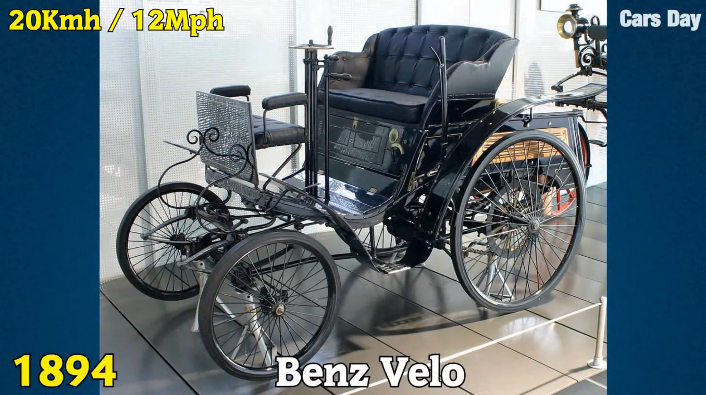
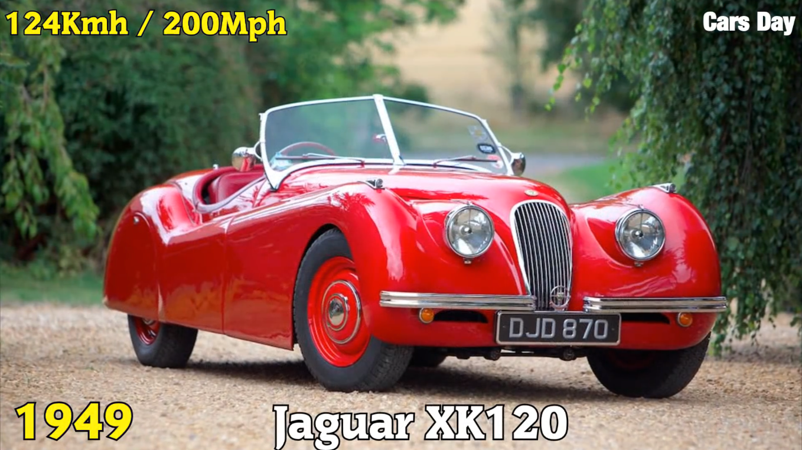
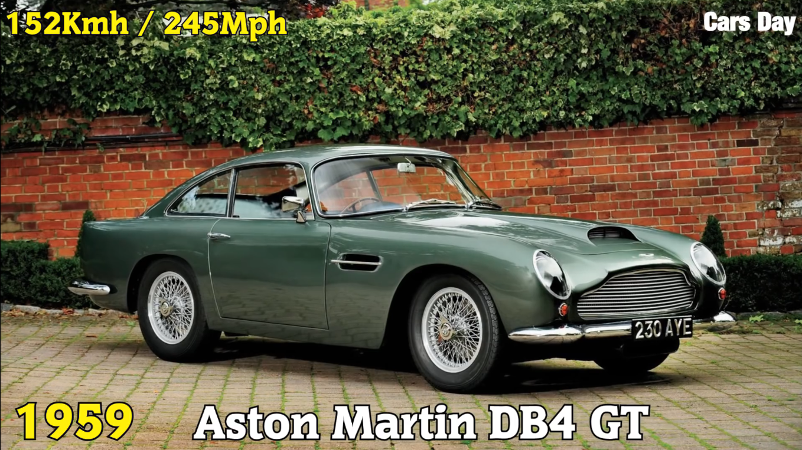
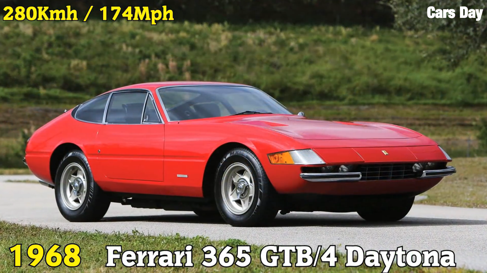
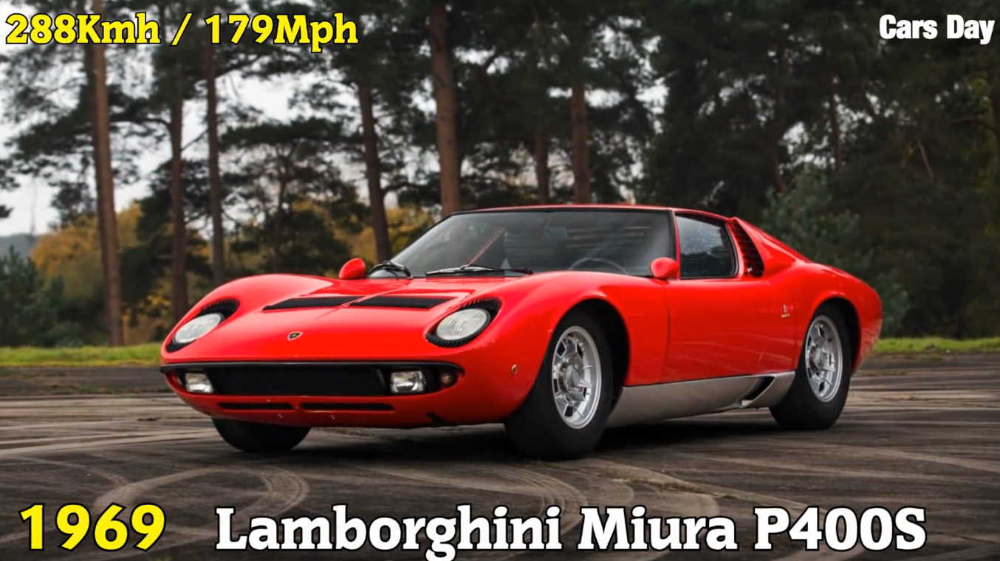
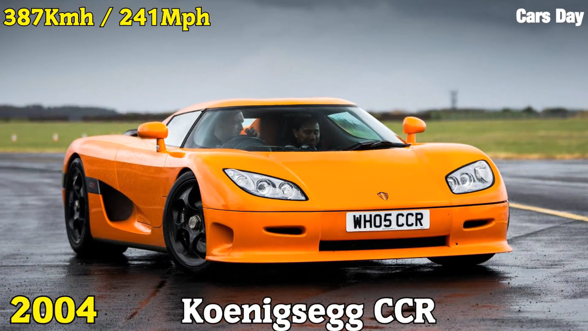

<a href="https://www.youtube.com/watch?v=PkkV1vLHUvQ">Bugatti<br></a>

<a href="https://youtu.be/R1g07RpTPFE?t=106">Koenigsegg</a>

```{r, message=FALSE}
years <- c(1894, 1949, 1955, 1959, 1963, 1965, 1967, 1968, 1969, 1982, 1983, 1986, 1987, 1993, 2004, 2005, 2007, 2010, 2017)


makeModel <- c("Benz Velo", "Jaguar XK120", "Mercedes-Benz 300SL", "Aston Martin DB4 GT", "Iso Grifo GL 365", "AC Cobra Mk III 427", "Lamborghini Miura P400", "Ferrari 365 GTB/4 Daytona", "Lamborghini Miura P400S", "Lamborghini Countach LP500 S", "Ruf BTR", "Porsche 959", "Ruf CTR", "McLaren F1", "Koenigsegg CCR", "Bugatti Veyron EB 16.4", "SSC Ultimate Aero TT", "Bugatti Veyron 16.4 Super Sport", "Koenigsegg Agera RS")

```

```{r}
speed <- c(12, 124.6, 150.7, 152, 161, 165, 171, 174, 179.3, 182, 190, 198, 213, 221, 241.009, 253.81, 256.18, 258, 277.87)
plot(speed)
```
</img>
```{r}
plot(speed[-1])
```

```{r}
engineSize <- c(1045, 3442, 2996, 3670, 5345, 6998, 3929, 4390, 3929, 4754, 3367, 2849, 3367, 6064, 4700, 7993, 6345, 7993, 5000)
plot(engineSize[-1])
plot(speed[-1], engineSize[-1])
speedEngineSizeCorrelation <- cor(speed[-1], engineSize[-1])

```


</img>

```{r}
brakeHorsepower <- c(1.5, 160, 212, 302, 360, 485, 350, 352, 370, 375, 369, 444, 463, 618, 806, 987, 1183, 1183, 1341)
plot(brakeHorsepower[-1])
plot(speed[-1], brakeHorsepower[-1])
speedBrakeHorsepowerCorrelation <- cor(speed[-1], brakeHorsepower[-1])
```

```{r}
torque <- c(NA, 193, 217, 240, 360, 480, 295, 318, 295, 308, 350, 369, 408, 479, 679, 922, 634, 1106, 944)
plot(torque[-1])
plot(speed[-1], torque[-1])
speedTorqueCorrelation <- cor(speed[-1], torque[-1])
```

```{r}
numberOfCylinders <- c(1, 6, 6, 6, 8, 8, 12, 12, 12, 12, 6, 6, 6, 12, 8, 16, 8, 16, 8)
plot(numberOfCylinders[-1])
plot(speed[-1], numberOfCylinders[-1])
speedNumberOfCylindersCorrelation <- cor(speed[-1], numberOfCylinders[-1])
```


```{r}
turboChargers <- c(0, 0, 0, 0, 0, 0, 0, 0, 0, 0, 1, 2, 2, 0, 2, 4, 0, 4, 2)
plot(turboChargers[-1])
plot(speed[-1], turboChargers[-1])
speedTurboChargersCorrelation <- cor(speed[-1], turboChargers[-1])
```

```{r}
curbWeight <- c(NA, 2855, 3307, 2798, 3042, 2529, 2851, 3582, 2848, 3263, 3285, 2990, 3505, 2535, 2509, 2601, 4052, 2800, 4387, 3075)
plot(curbWeight[-1])
plot(speed[-1], curbWeight[-1:-2])
speedCurbWeightCorrelation <- cor(speed[-1], curbWeight[-1:-2])
```

```{r}
transmission <- c("auto", "auto", "auto", "auto", "manual", "manual", "manual", "manual", "manual", "manual", "manual", "manual", "manual", "manual", "manual", "dct", "auto", "dct", "dct")
table(makeModel[-1], transmission[-1])
```

```{r}
aerialDragCoefficient <- c(NA, 0.55, 0.25, 0.45, 0.40, 0.5, 0.4, 0.4, 0.4, 0.42, 0.4, 0.31, 0.4, 0.32, 0.297, 0.26, 0.357, 0.26, 0.33)
plot(aerialDragCoefficient)
plot(speed[-1], aerialDragCoefficient[-1])
speedAerialDragCoefficient <- cor(speed[-1], aerialDragCoefficient[-1])
```


```{r}
plot(speed[-1], years[-1])
speedYearCorrelation <- cor(speed[-1], years[-1])
```


</img>
</img>
</img>
</img>
</img>
</img>
</img>
</img>
</img>
</img>
</img>
</img>
</img>
</img>
</img>
</img>
</img>
</img>


