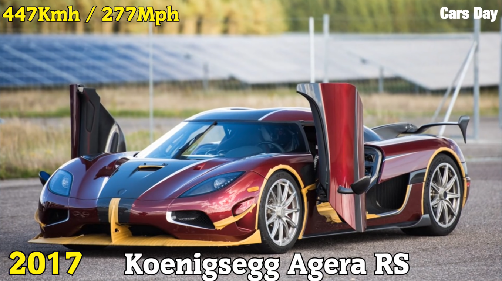
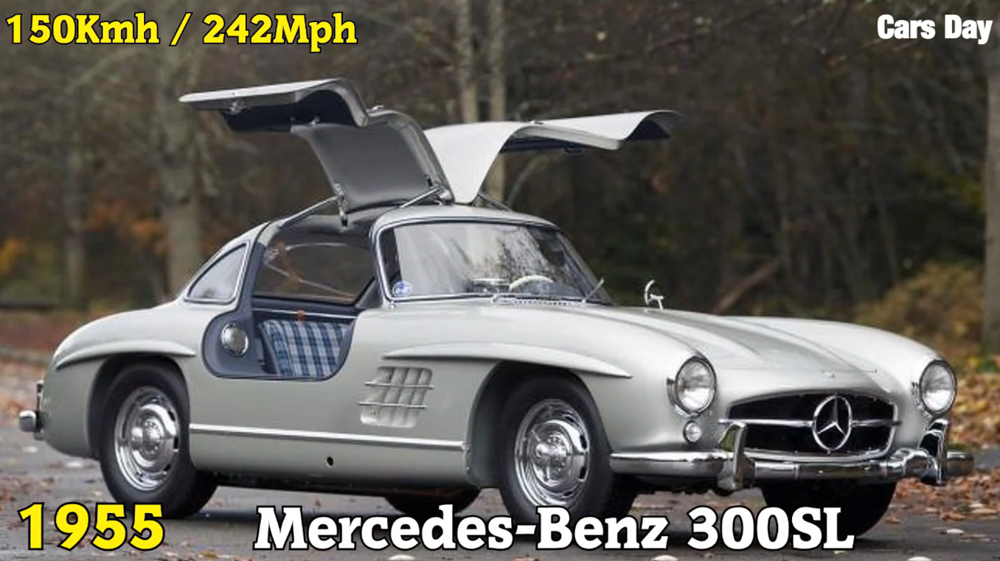
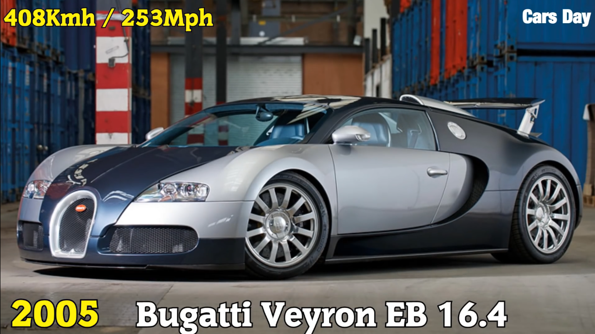
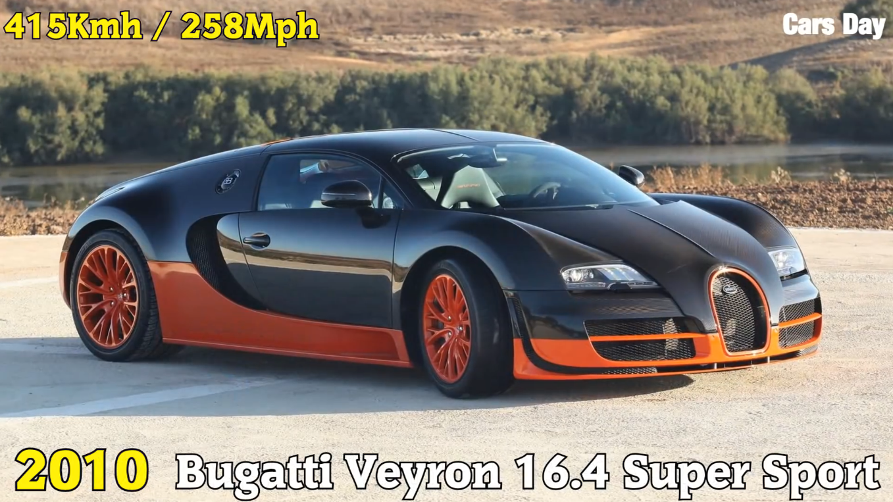
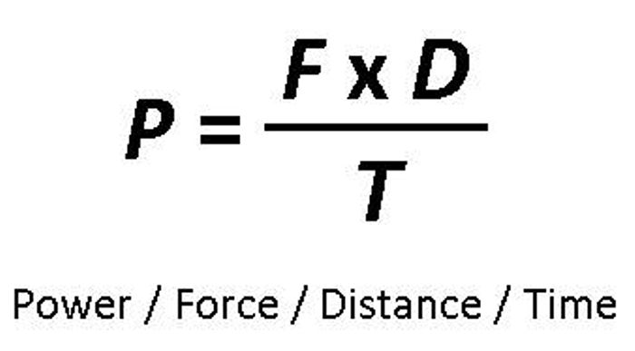
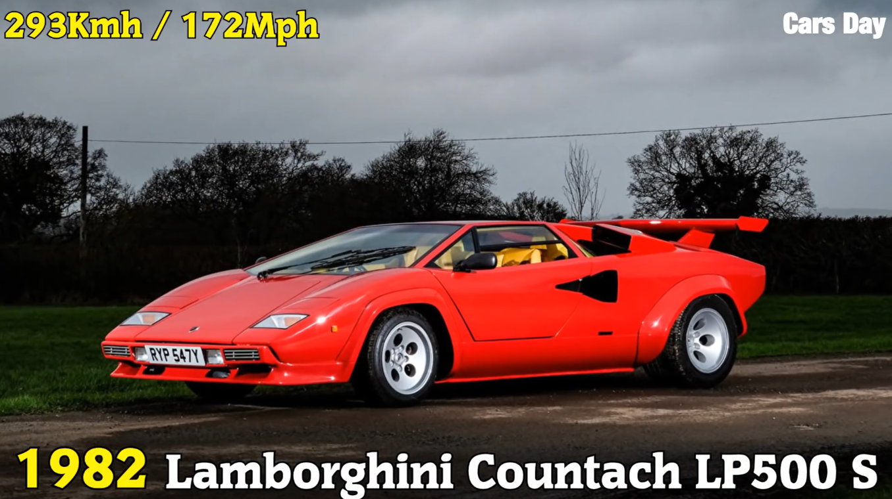

<a href="https://www.youtube.com/watch?v=PkkV1vLHUvQ">Bugatti<br></a>

<a href="https://youtu.be/R1g07RpTPFE?t=106">Koenigsegg</a>


##Introduction

```{r, message=FALSE}
library(ggplot2)
library(knitr)
library(kableExtra)
options(knitr.table.format = "html") 

years <- c(1894, 1949, 1955, 1959, 1963, 1965, 1967, 1968, 1969, 1982, 1983, 1986, 1987, 1993, 2004, 2005, 2007, 2010, 2017)


makeModel <- c("Benz Velo", "Jaguar XK120", "Mercedes-Benz 300SL", "Aston Martin DB4 GT", "Iso Grifo GL 365", "AC Cobra Mk III 427", "Lamborghini Miura P400", "Ferrari 365 GTB/4 Daytona", "Lamborghini Miura P400S", "Lamborghini Countach LP500 S", "Ruf BTR", "Porsche 959", "Ruf CTR", "McLaren F1", "Koenigsegg CCR", "Bugatti Veyron EB 16.4", "SSC Ultimate Aero TT", "Bugatti Veyron 16.4 Super Sport", "Koenigsegg Agera RS")

speed <- c(12, 124.6, 150.7, 152, 161, 165, 171, 174, 179.3, 182, 190, 198, 213, 221, 241.009, 253.81, 256.18, 258, 277.87)

data.frame(years, makeModel, floor(speed)) %>%
  kable() %>%
  kable_styling()

```

```{r}

ggplot(data.frame(speed), aes(x = speed, y = c(1, 2, 3, 4, 5, 6, 7, 8, 9, 10, 11, 12, 13, 14, 15, 16, 17, 18, 19))) +
    geom_point() + 
    labs(title = "Speed in Miles Per Hour", x = "Speed (MPH)", y = "Car")

```
</img>

```{r}

ggplot(data.frame(speed[-1]), aes(x = speed[-1], y = c(1, 2, 3, 4, 5, 6, 7, 8, 9, 10, 11, 12, 13, 14, 15, 16, 17, 18))) +
    geom_point() + 
    labs(title = "Speed in Miles Per Hour (without Benz Velo)", x = "Speed (MPH)", y = "Car")

```

</img>

<br>
<br>
<hr>
<br>
<br>

##Transmission Type

```{r}
transmission <- c("auto", "auto", "auto", "auto", "manual", "manual", "manual", "manual", "manual", "manual", "manual", "manual", "manual", "manual", "manual", "dct", "auto", "dct", "dct")

data.frame(makeModel, transmission) %>%
  kable() %>%
  kable_styling()
```

<br>
<br>
<hr>
<br>
<br>

##Curb Weight

```{r}
curbWeight <- c(NA, 2855, 3307, 2883, 3550, 2019, 2848, 2646, 2848, 2978, 2990, 3505, 2535, 2509, 2601, 4052, 2800, 4387, 3075)

data.frame(makeModel[-1], curbWeight[-1]) %>%
  kable() %>%
  kable_styling()

sd(curbWeight[-1])
range(curbWeight[-1])

ggplot(data.frame(curbWeight[-1]), aes(y = curbWeight[-1], x = c(1, 2, 3, 4, 5, 6, 7, 8, 9, 10, 11, 12, 13, 14, 15, 16, 17, 18))) +
    geom_point() + 
    labs(title = "Curb Weight", x = "Car", y = "Curb Weight (Pounds)")

ggplot(data.frame(speed[-1], curbWeight[-1]), aes(y = curbWeight[-1], x = speed[-1])) +
    geom_point() + 
    labs(title = "Speed vs. Curb Weight", x = "Speed (MPH)", y = "Curb Weight (Pounds)")
```

</img>

</img>

```{r}
speedCurbWeightCorrelation <- cor(speed[-1], curbWeight[-1])
speedCurbWeightCorrelation
```

<br>
<br>
<hr>
<br>
<br>

##Aerial Drag Coefficient

</img>

</img>


```{r}
aerialDragCoefficient <- c(NA, 0.55, 0.25, 0.45, 0.40, 0.5, 0.4, 0.4, 0.4, 0.42, 0.4, 0.31, 0.4, 0.32, 0.297, 0.26, 0.357, 0.26, 0.33)

data.frame(makeModel[-1], aerialDragCoefficient[-1]) %>%
  kable() %>%
  kable_styling()

ggplot(data.frame(aerialDragCoefficient[-1]), aes(y = aerialDragCoefficient[-1], x = c(1, 2, 3, 4, 5, 6, 7, 8, 9, 10, 11, 12, 13, 14, 15, 16, 17, 18))) +
    geom_point() + 
    labs(title = "Aerial Drag Coefficient", x = "Car", y = "Aerial Drag Coefficient")

ggplot(data.frame(speed[-1], aerialDragCoefficient[-1]), aes(y = aerialDragCoefficient[-1], x = speed[-1])) +
    geom_point() + 
    labs(title = "Speed vs. Aerial Drag Coefficient", x = "Speed (MPH)", y = "Aerial Drag Coefficient")
```

</img>


```{r}
speedAerialDragCoefficient <- cor(speed[-1], aerialDragCoefficient[-1])
speedAerialDragCoefficient
```

<br>
<br>
<hr>
<br>
<br>

##Engine Size and Cylinder Count

```{r}
engineSize <- c(1045, 3442, 2996, 3670, 5345, 6998, 3929, 4390, 3929, 4754, 3367, 2849, 3367, 6064, 4700, 7993, 6345, 7993, 5000)

data.frame(makeModel, engineSize) %>%
  kable() %>%
  kable_styling()

ggplot(data.frame(engineSize[-1]), aes(y = engineSize[-1], x = c(1, 2, 3, 4, 5, 6, 7, 8, 9, 10, 11, 12, 13, 14, 15, 16, 17, 18))) +
    geom_point() + 
    labs(title = "Engine Size", x = "Car", y = "Engine Size (Cubic Centimeters)")

ggplot(data.frame(speed[-1], engineSize[-1]), aes(y = engineSize[-1], x = speed[-1])) +
    geom_point() + 
    labs(title = "Speed vs. Engine Size", x = "Speed (MPH)", y = "Engine Size (Cubic Centimeters)")
```


```{r}
speedEngineSizeCorrelation <- cor(speed[-1], engineSize[-1])
speedEngineSizeCorrelation
```

</img>

</img>

</img>


```{r}
numberOfCylinders <- c(1, 6, 6, 6, 8, 8, 12, 12, 12, 12, 6, 6, 6, 12, 8, 16, 8, 16, 8)

data.frame(makeModel, numberOfCylinders) %>%
  kable() %>%
  kable_styling()

ggplot(data.frame(numberOfCylinders[-1]), aes(y = numberOfCylinders[-1], x = c(1, 2, 3, 4, 5, 6, 7, 8, 9, 10, 11, 12, 13, 14, 15, 16, 17, 18))) +
    geom_point() + 
    labs(title = "Number of Cylinders", x = "Car", y = "Number of Cylinders")

ggplot(data.frame(speed[-1], numberOfCylinders[-1]), aes(y = numberOfCylinders[-1], x = speed[-1])) +
    geom_point() + 
    labs(title = "Speed vs. Number of Cylinders", x = "Speed (MPH)", y = "Number of Cylinders")
```


</img>

</img>

```{r}
speedNumberOfCylindersCorrelation <- cor(speed[-1], numberOfCylinders[-1])
speedNumberOfCylindersCorrelation
```

<br>
<br>
<hr>
<br>
<br>

##Turbochargers

<p style="text-align: center;></img></p>


```{r}
turboChargers <- c(0, 0, 0, 0, 0, 0, 0, 0, 0, 0, 1, 2, 2, 0, 2, 4, 0, 4, 2)

data.frame(makeModel, turboChargers) %>%
  kable() %>%
  kable_styling()

ggplot(data.frame(turboChargers[-1]), aes(y = turboChargers[-1], x = c(1, 2, 3, 4, 5, 6, 7, 8, 9, 10, 11, 12, 13, 14, 15, 16, 17, 18))) +
    geom_point() + 
    labs(title = "Number of Turbochargers", x = "Car", y = "Number of Turbochargers")

ggplot(data.frame(speed[-1], turboChargers[-1]), aes(y = turboChargers[-1], x = speed[-1])) +
    geom_point() + 
    labs(title = "Speed vs. Number of Turbochargers", x = "Speed (MPH)", y = "Number of Turbochargers")
```

</img>

```{r}
speedTurboChargersCorrelation <- cor(speed[-1], turboChargers[-1])
speedTurboChargersCorrelation
```

<br>
<br>
<hr>
<br>
<br>

##Torque and Horsepower

<p style="text-align: center;"><br></img></p>

<p style="text-align: center;"></img></p>

<p style="text-align: center;"></img></p>

```{r}
brakeHorsepower <- c(1.5, 160, 212, 302, 360, 485, 350, 352, 370, 375, 369, 444, 463, 618, 806, 987, 1183, 1183, 1341)

data.frame(makeModel, brakeHorsepower) %>%
  kable() %>%
  kable_styling()

ggplot(data.frame(brakeHorsepower[-1]), aes(y = brakeHorsepower[-1], x = c(1, 2, 3, 4, 5, 6, 7, 8, 9, 10, 11, 12, 13, 14, 15, 16, 17, 18))) +
    geom_point() + 
    labs(title = "Brake Horsepower", x = "Car", y = "Brake Horsepower")

ggplot(data.frame(speed[-1], brakeHorsepower[-1]), aes(y = brakeHorsepower[-1], x = speed[-1])) +
    geom_point() + 
    labs(title = "Speed vs. Brake Horsepower", x = "Speed (MPH)", y = "Brake Horsepower")


speedBrakeHorsepowerCorrelation <- cor(speed[-1], brakeHorsepower[-1])
speedBrakeHorsepowerCorrelation
```

```{r}
torque <- c(NA, 193, 217, 240, 360, 480, 295, 318, 295, 308, 350, 369, 408, 479, 679, 922, 634, 1106, 944)

data.frame(makeModel[-1], torque[-1]) %>%
  kable() %>%
  kable_styling()

ggplot(data.frame(torque[-1]), aes(y = torque[-1], x = c(1, 2, 3, 4, 5, 6, 7, 8, 9, 10, 11, 12, 13, 14, 15, 16, 17, 18))) +
    geom_point() + 
    labs(title = "Torque", x = "Car", y = "Torque (Pound-Feet)")

ggplot(data.frame(speed[-1], torque[-1]), aes(y = torque[-1], x = speed[-1])) +
    geom_point() + 
    labs(title = "Speed vs. Torque", x = "Speed (MPH)", y = "Torque (Pound-Feet)")


speedTorqueCorrelation <- cor(speed[-1], torque[-1])
speedTorqueCorrelation
```

<br>
<br>
<hr>
<br>
<br>


##Conclusion

```{r}

ggplot(data.frame(speed[-1], years[-1]), aes(y = years[-1], x = speed[-1])) +
    geom_point() + 
    labs(title = "Speed vs. Year", x = "Speed (MPH)", y = "Year")

ggplot(data.frame(speed, years), aes(y = years, x = speed)) +
    geom_point() + 
    labs(title = "Speed vs. Year", x = "Speed (MPH)", y = "Year")

speedYearCorrelation <- cor(speed, years)
speedYearCorrelation
```


</img>

</img>

</img>

</img>

</img>

</img>

</img>

</img>
